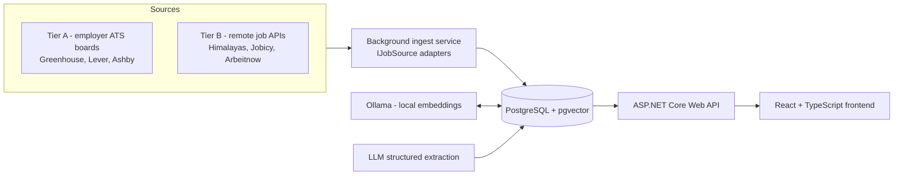

# EmployMe — Personal Job Vacancy Aggregator with Semantic Matching

*(working title — rename freely once the project has its own repo)*

A personal tool that aggregates job postings from employers' own ATS boards (Greenhouse, Lever, Ashby, Workable, Recruitee, Personio) and from public remote-job APIs (Himalayas, Jobicy, Remotive, RemoteOK, Arbeitnow), ranks them against my own CV using semantic embeddings, deduplicates postings across sources, and tracks my application pipeline end to end.

Built as a portfolio project to practice a production-shaped engineering process — not just a language exercise — while directly supporting my own job search.

## Why this exists

Generic vacancy aggregators (job boards, junior-focused bots, etc.) show the same list to everyone. This project is deliberately personal:

- It ranks vacancies against **my** stack and preferences, with an explainable score, not a generic keyword filter.
- It reads **employers' own ATS boards** directly, not just aggregator feeds — so it sees postings that never reach a job board, against a target-company registry that is mine.
- It **deduplicates** the same vacancy posted across sources in different languages using semantic similarity, not string matching.
- It doubles as my **personal application tracker**, replacing a spreadsheet.
- Extraction and matching quality are **measured** against a hand-labeled sample, not assumed.
- Every source's terms of use are **read and recorded before an integration is written**, and every card credits its source. See [`docs/SOURCES.md`](./docs/SOURCES.md).

## Features

- Multi-source ingestion across two tiers: employer ATS boards (Tier A, fetched per company) and public remote-job APIs (Tier B). Sources are database rows with an adapter class, not an enum — adding one is a class plus a row, and losing one is a flipped boolean
- Source health monitoring: a nightly contract test that catches an upstream endpoint closing within 24 hours
- Semantic fit-score: CV ↔ vacancy embeddings compared via cosine similarity, with a human-readable explanation of matched/missing requirements
- Cross-source semantic deduplication of near-identical postings
- LLM-based structured extraction into JSON (seniority, tech stack, work format, language requirements)
- Personal application tracker: viewed → applied → interview → rejected → offer, with notes and dates
- Measured pipeline quality: precision of extraction and matching against a manually labeled 50-vacancy set

## Architecture

| Layer | Technology |
|---|---|
| Backend | ASP.NET Core Web API, EF Core |
| Database | PostgreSQL + pgvector extension |
| Embeddings / matching | Ollama (bge-m3 / e5), cosine similarity |
| Frontend | React + TypeScript (Vite) |
| Scheduling | `BackgroundService` / Hangfire |
| Resilience | `HttpClient` + Polly |
| Testing | xUnit, Testcontainers |
| CI/CD | GitHub Actions |
| Deployment | Railway |
| Error monitoring | Sentry |
| Dev environment | Dev Container (Docker/Podman) |

## Getting started

This project is developed inside a [Dev Container](https://containers.dev/), so the environment is reproducible with no manual setup beyond Docker/Podman and an editor that supports the Dev Containers spec (VS Code or the Dev Containers CLI).

1. Clone the repository.
2. Open it in VS Code and choose **Reopen in Container** (or run `devcontainer up` via the CLI).
3. The container provisions: .NET SDK, Node.js, a local PostgreSQL instance with `pgvector`, a local Ollama instance, and Claude Code (via the official `ghcr.io/anthropics/devcontainer-features/claude-code` feature).
4. Copy `.env.example` to `.env` and fill in the required values (`SENTRY_DSN`, connection strings). The MVP sources need no API keys.
5. Run the backend: `dotnet run --project src/Api`
6. Run the frontend: `npm install && npm run dev` (from `src/Web`)

Production deployment, error monitoring, and project tracking are external services (Railway, Sentry, Linear) — see [`docs/PLAN.md`](./docs/PLAN.md) for how they fit into the workflow.

## Project status

Actively in development, following a phased plan — see [`docs/PLAN.md`](./docs/PLAN.md) for the full roadmap, acceptance criteria per phase, and estimated timeline. The plan is at Revision 2: the original hh.ru-based design was falsified and rebuilt around multi-source ingestion. That post-mortem is [`docs/ASSUMPTIONS.md`](./docs/ASSUMPTIONS.md) entry A-000, and it is deliberately kept in the repository.

Supporting documents: [`docs/SOURCES.md`](./docs/SOURCES.md) (source registry, tiers, terms of use) and [`docs/ASSUMPTIONS.md`](./docs/ASSUMPTIONS.md) (assumption register with verification levels and expiry dates).

## License

[MIT](./LICENSE) — chosen deliberately for a portfolio project: instantly recognizable, no ambiguity for anyone reviewing the code, no friction for reuse.

## Author

**Nikita Polovykh** — Junior Software Developer, Tbilisi, Georgia
[github.com/nupolovykh](https://github.com/nupolovykh) · devpolovykh@protonmail.com
