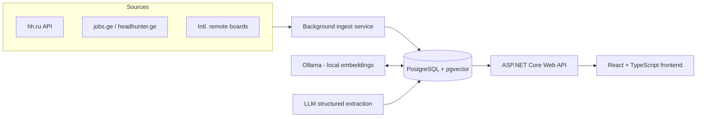

# EmployMe — Personal Job Vacancy Aggregator with Semantic Matching

*(working title — rename freely once the project has its own repo)*

A personal tool that aggregates job vacancies from multiple markets (Russia, Georgia, international remote boards), ranks them against my own CV using semantic embeddings, deduplicates postings across sources, and tracks my application pipeline end to end.

Built as a portfolio project to practice a production-shaped engineering process — not just a language exercise — while directly supporting my own job search.

## Why this exists

Generic vacancy aggregators (job boards, junior-focused bots, etc.) show the same list to everyone. This project is deliberately personal:

- It ranks vacancies against **my** stack and preferences, with an explainable score, not a generic keyword filter.
- It covers **three markets in one place** (RU, Georgia, international remote) that no single existing aggregator combines.
- It **deduplicates** the same vacancy posted across sources in different languages using semantic similarity, not string matching.
- It doubles as my **personal application tracker**, replacing a spreadsheet.
- Extraction and matching quality are **measured** against a hand-labeled sample, not assumed.

## Features

- Multi-source ingestion: hh.ru (official API), jobs.ge / headhunter.ge, international remote boards (RSS/API)
- Semantic fit-score: CV ↔ vacancy embeddings compared via cosine similarity, with a human-readable explanation of matched/missing requirements
- Cross-source semantic deduplication of near-identical postings
- LLM-based structured extraction into JSON (seniority, tech stack, work format, language requirements)
- Personal application tracker: viewed → applied → interview → rejected → offer, with notes and dates
- Measured pipeline quality: precision of extraction and matching against a manually labeled 50-vacancy set

## Architecture

| Layer | Technology |
|---|---|
| Backend | ASP.NET Core Web API, EF Core |
| Database | PostgreSQL + pgvector extension |
| Embeddings / matching | Ollama (bge-m3 / e5), cosine similarity |
| Frontend | React + TypeScript (Vite) |
| Scheduling | `BackgroundService` / Hangfire |
| Resilience | `HttpClient` + Polly |
| Testing | xUnit, Testcontainers |
| CI/CD | GitHub Actions |
| Deployment | Railway |
| Error monitoring | Sentry |
| Dev environment | Dev Container (Docker/Podman) |

## Getting started

This project is developed inside a [Dev Container](https://containers.dev/), so the environment is reproducible with no manual setup beyond Docker/Podman and an editor that supports the Dev Containers spec (VS Code or the Dev Containers CLI).

1. Clone the repository.
2. Open it in VS Code and choose **Reopen in Container** (or run `devcontainer up` via the CLI).
3. The container provisions: .NET SDK, Node.js, a local PostgreSQL instance with `pgvector`, a local Ollama instance, and Claude Code (via the official `ghcr.io/anthropics/devcontainer-features/claude-code` feature).
4. Copy `.env.example` to `.env` and fill in the required values (hh.ru API credentials, `SENTRY_DSN`, connection strings).
5. Run the backend: `dotnet run --project src/Api`
6. Run the frontend: `npm install && npm run dev` (from `src/Web`)

Production deployment, error monitoring, and project tracking are external services (Railway, Sentry, Linear) — see [`PLAN.md`](./PLAN.md) for how they fit into the workflow.

## Project status

Actively in development, following a phased plan — see [`PLAN.md`](./PLAN.md) for the full roadmap, acceptance criteria per phase, and estimated timeline.

## License

[MIT](./LICENSE) — chosen deliberately for a portfolio project: instantly recognizable, no ambiguity for anyone reviewing the code, no friction for reuse.

## Author

**Nikita Polovykh** — Junior Software Developer, Tbilisi, Georgia
[github.com/nupolovykh](https://github.com/nupolovykh) · devpolovykh@protonmail.com
