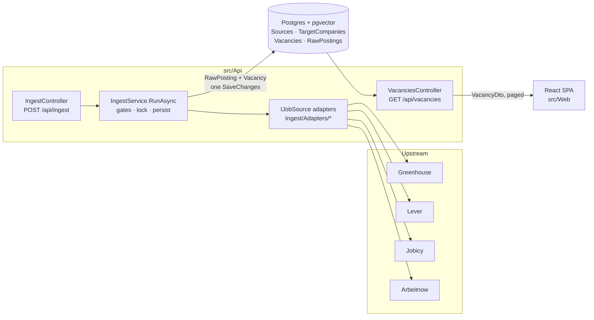

# Architecture

How EmployMe is put together, and why the non-obvious parts are the way they are. Describes
`main`.

Companion documents: [`DATA-MODEL.md`](./DATA-MODEL.md) for the tables,
[`CONFIGURATION.md`](./CONFIGURATION.md) for every setting, [`DEVELOPMENT.md`](./DEVELOPMENT.md)
for commands, [`FRONTEND.md`](./FRONTEND.md) for `src/Web`.

---

## The whole path in one picture



There are exactly two ways into the API: one write path (`POST /api/ingest`) and one read path
(`GET /api/vacancies`, `GET /api/vacancies/{id}`). Everything else is wiring.

---

## `src/Api` folder by folder

```
src/Api/
├── Program.cs              composition root: JSON, DbContext, options, HttpClient, DI, CORS
├── Controllers/
│   ├── IngestController    the only write path; shared-secret auth on public deployments
│   └── VacanciesController the only read path; filters, paging, projection to VacancyDto
├── Ingest/
│   ├── IJobSource          connector contract — one implementation per upstream source
│   ├── JobSourceContext    what an adapter is allowed to know about a run
│   ├── FetchedPosting      (NormalizedVacancy, raw JSON payload) pair an adapter yields
│   ├── NormalizedVacancy   the common shape every source is mapped into
│   ├── IngestService       the single orchestrator; knows no source by name
│   ├── IngestOptions       PublicDeployment, TriggerToken, MaxPagesPerSource
│   ├── IngestReport        per-source outcome returned by the endpoint
│   ├── IngestHttp          shared JsonElement helpers + the named HttpClient
│   ├── IngestResilience    the Polly pipeline every upstream request goes through
│   ├── HtmlText            HTML → plain text for descriptions
│   ├── SeniorityMap        source level strings → Seniority, measured tables
│   └── Adapters/           Greenhouse, Lever (Tier A) · Jobicy, Arbeitnow (Tier B)
├── Data/
│   ├── AppDbContext        DbSets + OnModelCreating (indexes, jsonb, vector, 1:1)
│   └── Migrations/         schema history, including data migrations — see DATA-MODEL.md
└── Models/                 entities + Dtos/ (VacancyDto, PagedResult)
```

The controllers are thin on purpose. `VacanciesController` queries EF directly (there is no
service layer for reads), and `IngestController` only authorizes and delegates to
`IngestService.RunAsync`, which holds all of the ingest logic.

---

## Ingest: one run, step by step

`IngestService.RunAsync(sourceSlug, force, ct)` loads one source by slug, or all of them, and for
each one runs a chain of gates **before** any network call. The first gate that fails ends that
source with outcome `skipped` and a reason; the others still run.

| # | Gate | Why it exists |
|---|---|---|
| 1 | `Tier` is `C` or `D` → refuse, whatever `Enabled` says | Tier D is never allowed (hh.ru, A-000). Tier C needs an approval the schema cannot record |
| 2 | `Enabled == false` → skip | Turning a source off is a flipped boolean, not a code change (`PLAN.md` §01.6) |
| 3 | public deployment and `PublicDeployEnabled == false` → skip | How Himalayas stays off production while technically working |
| 4 | no `IJobSource` registered for `AdapterType` → skip | A row without an adapter must not crash the run |
| 5 | `MinPollInterval` since `LastSuccessAt` not elapsed, and not `force` → skip | Jobicy caps polling at once an hour; the interval is per row, never a constant |
| 6 | advisory lock on the source not acquired → skip | Two concurrent runs of one source once breached Jobicy's cap for real |

Then, for a source that passed:

1. **Lock.** `pg_try_advisory_lock(LockNamespace, sourceId)` — non-blocking: if another run holds
   the source, this one skips instead of waiting. The lock belongs to a database *session*, so the
   connection is held open for the whole run; returning it to the pool would release the lock.
   `LockNamespace` (`0x656D_6749`) keeps these keys from colliding with any other advisory lock on
   the server.
2. **Targets.** Tier A sources have no search, only "give me company X's board". So for Tier A the
   service loads every `TargetCompany` of that source except `Rejected` (`Watch` is fetched too) and
   passes them in `JobSourceContext`. The registry *is* the list of requests the adapter makes.
3. **Fetch and persist.** The adapter streams `FetchedPosting`s. For each one the service upserts
   a `RawPosting` (the payload as received) and a `Vacancy` (the mapped fields), keyed by
   `(SourceId, ExternalId)`. Existing rows are attached and marked modified, new ones added; a
   single `SaveChangesAsync` at the end writes the source's postings, vacancies and
   `LastSuccessAt` in one transaction.
4. **Failure.** A failing source does not end the run. Only *its* entities are detached from the
   change tracker (detaching all of them would make the next successful source silently skip its
   `LastSuccessAt`), `LastErrorAt` and `ConsecutiveFailures` are written with `ExecuteUpdateAsync`,
   and the outcome is `failed` with "see server logs" — the exception text stays in the log because
   it can carry hosts and usernames from the connection string.
5. **Unlock** in `finally`. Releasing the lock swallows its own error: a throw from `finally` would
   discard the run's result, and Npgsql's `DISCARD ALL` on connection return releases every
   advisory lock anyway (PostReview on PR #16, A-012/A-013).

### Adapters

All four implement `IJobSource.FetchAsync(JobSourceContext, CancellationToken) →
IAsyncEnumerable<FetchedPosting>` and are resolved by `Source.AdapterType` from a dictionary built
over `IEnumerable<IJobSource>`. Adding a source is one `AddSingleton<IJobSource, …>()` line in
`Program.cs` plus one row in `Sources` — see [`DEVELOPMENT.md`](./DEVELOPMENT.md#adding-a-source).

| Adapter | Tier | Specifics |
|---|---|---|
| `GreenhouseJobSource` | A | One request per target company (`/v1/boards/{token}/jobs`). A dead token logs a warning and continues — one 404 must not throw away the other companies' postings. Description is HTML → `HtmlText.ToPlainText`, otherwise keyword search would match `div` |
| `LeverJobSource` | A | Same per-company shape |
| `JobicyJobSource` | B | Supplies a level (`jobLevel`) → `SeniorityMap` |
| `ArbeitnowJobSource` | B | The only paginated source, bounded by `Ingest:MaxPagesPerSource` (5). Supplies `job_types` → `SeniorityMap` |

`Map()` in every adapter drops a posting that lacks its required fields (`return null`) instead of
throwing.

`SeniorityMap`'s tables were measured on real payloads (100 Jobicy, 650 Arbeitnow postings), not
guessed. Two deliberate choices: Jobicy's `"Any"` maps to `Unknown`, because open to any level does
not mean junior; Arbeitnow mixes contract types and levels in two languages, so `Highest()` takes
the highest *recognised* level and ignores the rest instead of collapsing to `Unknown`.

### Resilience: the Polly pipeline

Every upstream request goes through `AddStandardResilienceHandler(IngestResilience.Configure)` on
the named `HttpClient` (EM-20). The settings live in `Ingest/IngestResilience.cs`:

| Strategy | Setting | Why |
|---|---|---|
| Total timeout | 120 s per request, retries included | The slowest call observed is Greenhouse with `content=true` on a large board |
| Attempt timeout | 30 s | |
| Retry | 3 retries, exponential from 2 s with jitter, `Retry-After` honoured up to 30 s | Transport errors, timeouts, `408`, `429` and `5xx` are retried. `404` is not: on a Tier A board it means a dead token, which the adapter logs and skips |
| Circuit breaker | opens at 80 % failures over ≥ 5 requests in 60 s, for 5 min | The default needs 100 requests in its window, which an ingest run never reaches |

`SelectPipelineByAuthority()` gives each upstream host its own pipeline, so Jobicy answering `503`
opens the circuit for Jobicy alone, not for Greenhouse and Lever. A `Retry-After` longer than 30 s is
left to the next scheduled run: holding the request would hold the run's Neon connection (A-013).

---

## Reads: `VacanciesController`

`GET /api/vacancies` and `GET /api/vacancies/{id}` both project through one
`Expression<Func<Vacancy, VacancyDto>>`, so EF translates the projection into the `SELECT` instead
of loading entities to map them in memory.

| Filter | Behaviour | Why |
|---|---|---|
| `keyword` | `ILIKE` on title, company, description | Plain substring search. Structured stack search is EM-31 (Phase III) |
| `location` | `ILIKE` on location | |
| `publishedAfter` / `publishedBefore` | compared with `PublishedAt ?? FetchedAt` | Greenhouse/Lever often omit `PublishedAt`; `NULL >= x` is `NULL`, so a bare comparison would silently drop them |
| `seniority` | exact match; `Unknown` never matches a requested level | A posting that states no level is not a junior posting |
| `page`, `pageSize` | `pageSize` clamped to 1–100; `page` clamped so the offset cannot overflow | An unbounded `page` once produced a negative `OFFSET` and a 500 straight from the query string |

Order is `PublishedAt ?? FetchedAt` descending, then `Id` descending. The second key matters:
Jobicy dates have day precision, and without a tie-breaker Postgres may return equal rows in a
different order on each `LIMIT/OFFSET` query, so postings duplicated or vanished between pages.

### `EscapeLike`

```csharp
var pattern = $"%{EscapeLike(keyword)}%";
query = query.Where(v => EF.Functions.ILike(v.Title, pattern, LikeEscape));   // LikeEscape = "\"
```

`EscapeLike` puts `\` before every `\`, `%` and `_` in the user's text — backslash first, so the
ones it adds are not escaped again — and the query wraps the result in its own `%…%`.
`keyword = "100%"` becomes `ILIKE '%100\%%' ESCAPE '\'`, a literal `100%` anywhere. Without the
escaping the user's `%` would be a wildcard too, and `C_C` would match `CAC`.

---

## Write path security: `IngestController`

`POST /api/ingest?source=<slug>&force=<bool>` — both optional. Without `source` every source runs;
a `source` that matches nothing returns `404`. `force=true` bypasses `MinPollInterval`, which is
exactly why the endpoint cannot be open on the internet: a stranger looping it would get *us*
banned by Jobicy.

```
Ingest:PublicDeployment == false                → allowed (developer machine)
PublicDeployment == true, TriggerToken unset    → 503 "Ingest disabled"   (refuse rather than run unguarded)
PublicDeployment == true, TriggerToken set:
    X-Ingest-Token matches                      → allowed
    X-Ingest-Token missing or wrong             → 401 "Invalid ingest token"
```

The comparison is `CryptographicOperations.FixedTimeEquals`, not `==`: string equality returns at
the first differing byte, so response time leaks how much of a guess was right.

---

## Decisions in `Program.cs` that look optional and are not

| Setting | Reason |
|---|---|
| `JsonStringEnumConverter` | Enums travel as names. Numeric enums broke EM-59 in production: the API sent `"seniority": 0`, the frontend compared with `'Unknown'`, and every card showed a bare digit. Query binding already accepted names, which hid the bug |
| `EnableRetryOnFailure` (5 retries, ≤10 s) | Neon's free compute suspends after 5 idle minutes; the first query after that hits a dropped pooled connection. The retry turns that into latency instead of a 500 for whoever woke the site |
| `PublicDeployment ??= !IsDevelopment()` | Forgetting the setting yields the *strictest* mode. See [`CONFIGURATION.md`](./CONFIGURATION.md#ingestoptions) |
| Named `HttpClient`: `User-Agent` with the repo URL | Arbeitnow's terms ask callers to be identifiable, so a block can be lifted rather than applied to anonymous traffic |
| `HttpClient.Timeout` = the pipeline's 120 s + 5 s | Set above the resilience pipeline's total timeout, so the pipeline decides when a request has failed. Lower, it would cut a retry short as a bare `TaskCanceledException` |
| CORS only for `Cors:AllowedOrigins`, never `AllowAnyOrigin` | The API has a mutating endpoint. An empty list allows no cross-origin caller at all — the deployed frontend breaks loudly instead of the API opening quietly |
| `Database.Migrate()` at startup | The only way migrations reach Neon on Render without a separate deploy step |
| Swagger only in Development | `/swagger` exists locally, not on Render |
| `/health` | Liveness only — returns `{"status":"healthy"}` without touching the database |

---

## Deployment

| Piece | Where | Image |
|---|---|---|
| API | Render web service `employme-api.onrender.com` | `src/Api/Dockerfile`: SDK stage → `dotnet publish`, runtime on `aspnet:10.0` |
| Frontend | Render static site `employme-4uql.onrender.com` | `src/Web/Dockerfile` or Render's static build, with `VITE_API_URL` at build time |
| Database | Neon `eu-central-1`, pgvector 0.8.6 | — |

Both Dockerfiles read `PORT` when the container starts, bind `0.0.0.0`, and the API switches off
the config file watcher that exhausts inotify on Render's shared hosts — the reasons are under
"Container settings" in [`CONFIGURATION.md`](./CONFIGURATION.md#container-settings).
