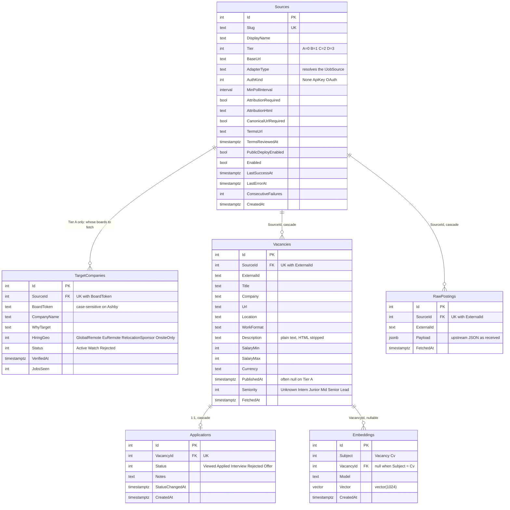

# Data model

The Postgres schema as EF Core defines it: `src/Api/Models/*.cs` for the entities,
`src/Api/Data/AppDbContext.cs` for everything attributes cannot say, `src/Api/Data/Migrations/`
for how the database got here. Generated from `AppDbContextModelSnapshot.cs` on `main`; when a
migration changes the schema, this file changes in the same PR. Tracked as EM-64.

---

## Entity-relationship diagram

Two things the diagram shows that the code does not make obvious:

- **`RawPostings` and `Vacancies` are not linked by a foreign key.** They pair up on
  `(SourceId, ExternalId)`, which is unique in both tables. `IngestService` writes both in the same
  `SaveChanges`.
- **Enums are stored as integers** (`Tier`, `Status`, `Seniority`, …) but travel through the API as
  names, because of `JsonStringEnumConverter`. A raw SQL query sees `2`, the frontend sees
  `"Junior"`. Never reorder an enum's members: the stored numbers would change meaning. This is
  why `RebuildSourcesSchema` dropped and re-added the old `SourceType` column instead of renaming it.

---

## Tables

| Table | Status | What it is |
|---|---|---|
| `Sources` | live | The source registry. One row per upstream, carrying its compliance facts (tier, terms, attribution, `PublicDeployEnabled`) and its runtime state (`LastSuccessAt`, `ConsecutiveFailures`). A source is a row plus an adapter class, not an enum (`PROCESS.md` rule 6, EM-51) |
| `TargetCompanies` | live | The employers whose ATS boards are fetched. Exists only because Tier A has no search — you can only ask for one company's board by its token (EM-50) |
| `Vacancies` | live | A posting after mapping: the fields the API filters and returns |
| `RawPostings` | live | The upstream payload of the **latest** fetch, one row per posting. Lets a mapping bug be replayed from stored JSON instead of re-polling a rate-limited source (EM-58) |
| `Embeddings` | **empty** | Created with the Phase 0 schema (EM-26). Nothing writes to it until Ollama (EM-27) and embedding generation (EM-28) land in Phase III |
| `Applications` | **unused** | Inherited from the Phase 0 draft schema. No endpoint or UI reads or writes it until Phase IV (EM-34–37) |

### Constraints and why each exists

All of them are declared in `AppDbContext.OnModelCreating`. Each makes the database refuse a state
the application is supposed to prevent, so the invariant survives a second writer, a retry or a bug.

| Constraint | Prevents |
|---|---|
| `Sources.Slug` unique | Two rows answering to `greenhouse` |
| `Vacancies (SourceId, ExternalId)` unique | Importing the same posting twice from one source. Greenhouse `123` and Lever `123` are different postings, so the key is the pair |
| `RawPostings (SourceId, ExternalId)` unique | A row per *fetch* instead of per posting. Before EM-58 the table grew with polling frequency — about 6 MB a run against Neon's 0.5 GB. The index, not `IngestService`, is what enforces retention |
| `RawPostings.Payload` is `jsonb` | Storing JSON as opaque text; `jsonb` can be queried into |
| `TargetCompanies (SourceId, BoardToken)` unique | Registering one board twice under the same ATS |
| `Applications.VacancyId` unique + `HasOne/WithOne` | The FK alone allows many applications per vacancy; the unique index is what makes it 1:1 |
| `HasPostgresExtension("vector")` | Creating `Embeddings.Vector` on a server without pgvector |

Deleting a `Source` cascades to its vacancies, raw postings and target companies; deleting a
`Vacancy` cascades to its application. Embeddings do not cascade.

---

## Seeded data

Reference data is seeded by **data migrations** (`InsertData` / `UPDATE`), not by a script outside
git. The reason a source has its tier, or a company is in the registry, is in the migration's
comment and in `git blame`, not only in `docs/SOURCES.md`.

| Source | Tier | `MinPollInterval` | Attribution required | State |
|---|---|---|---|---|
| `greenhouse` | A | 1 h | no | enabled |
| `lever` | A | 1 h | no | enabled |
| `jobicy` | B | 1 h — Jobicy's own cap | yes | enabled |
| `arbeitnow` | B | 1 h | yes | enabled |
| `himalayas` | C | 24 h | yes | disabled, not publicly deployable — terms require prior written approval (A-003); moved from B by `MoveHimalayasToTierC` |

| Company | ATS | Board token | Status |
|---|---|---|---|
| Remote | Greenhouse | `remotecom` | seeded by `SeedGreenhouseLeverTargetCompanies` |
| Remote People | Greenhouse | `remotepeople` | 〃 |
| Xapo Bank | Greenhouse | `xapo61` | 〃 |
| Qonto | Lever | `qonto` | 〃 |
| RemoFirst | Lever | `remofirst` | 〃 |
| Peerspace | Lever | `peerspace` | 〃 |
| Sezzle | Greenhouse | `sezzle` | `Rejected` — fails the hiring-geography criterion. Kept so the company is never evaluated again |

How to add one: [`DEVELOPMENT.md`](./DEVELOPMENT.md#adding-a-target-company).

---

## Migration history

Read top to bottom, this is the project's history. Every migration has a `.cs` (`Up`/`Down`) and a
`.Designer.cs` (EF's metadata for that step); `AppDbContextModelSnapshot.cs` is the model after all
of them, and is what `dotnet ef migrations add` diffs `Models/` against. Applied migrations are
recorded in `__EFMigrationsHistory`.

| Migration | Kind | What it did |
|---|---|---|
| `InitialCreate` (2026-07-31) | schema | Phase 0 draft: vacancies, sources (as an enum), applications, embeddings — still shaped for hh.ru (EM-7, EM-12) |
| `RebuildSourcesSchema` | schema | Dropped the `SourceType {HhRu, JobsGe, International}` enum and rebuilt `Sources` as rows with compliance columns (EM-51) |
| `AddTargetCompanies` | schema | The registry table |
| `SeedGreenhouseLeverTargetCompanies` | data | Greenhouse and Lever rows, plus the six registry companies (EM-50) |
| `RecordSezzleRejection` | data | Sezzle as `Rejected` |
| `SeedTierBSources` | data | Jobicy, Arbeitnow, Himalayas (EM-53) |
| `BoundRawPostingsToOneRowPerPosting` | schema | Unique `(SourceId, ExternalId)` on `RawPostings` (EM-58) |
| `AddVacancySeniority` | schema | `Vacancies.Seniority` (EM-59) |
| `MoveHimalayasToTierC` | data | `UPDATE` only: Himalayas B → C (A-003) |

Migrations run automatically at API startup (`Database.Migrate()` in `Program.cs`) — that is how
they reach Neon on Render. Locally, `dotnet ef database update` does the same; see
[`DEVELOPMENT.md`](./DEVELOPMENT.md#migrations).

---

## Glossary

| Term | Meaning here |
|---|---|
| **Slug** | Stable, lowercase, URL-safe identifier of a source (`greenhouse`, `lever`). Unique. Used in `?source=` and in code instead of the numeric id |
| **ExternalId** | The id the *upstream* gave the posting (Greenhouse's job id, Lever's posting id). Unique only together with `SourceId` |
| **Payload** | The upstream JSON for one posting, exactly as received, before mapping. Stored in `RawPostings.Payload` |
| **BoardToken** | The company's identifier on its ATS — the `{token}` in `boards-api.greenhouse.io/v1/boards/{token}/jobs`. Stored with exact casing |
| **Tier** | A: employer ATS board. B: public remote-job API, display conditional on attribution. C: needs registration or approval, never ingested. D: disqualified, never ingested and never publicly deployable |
| **Target company** | A company whose board is fetched, entered only after its board answered `200` live |
